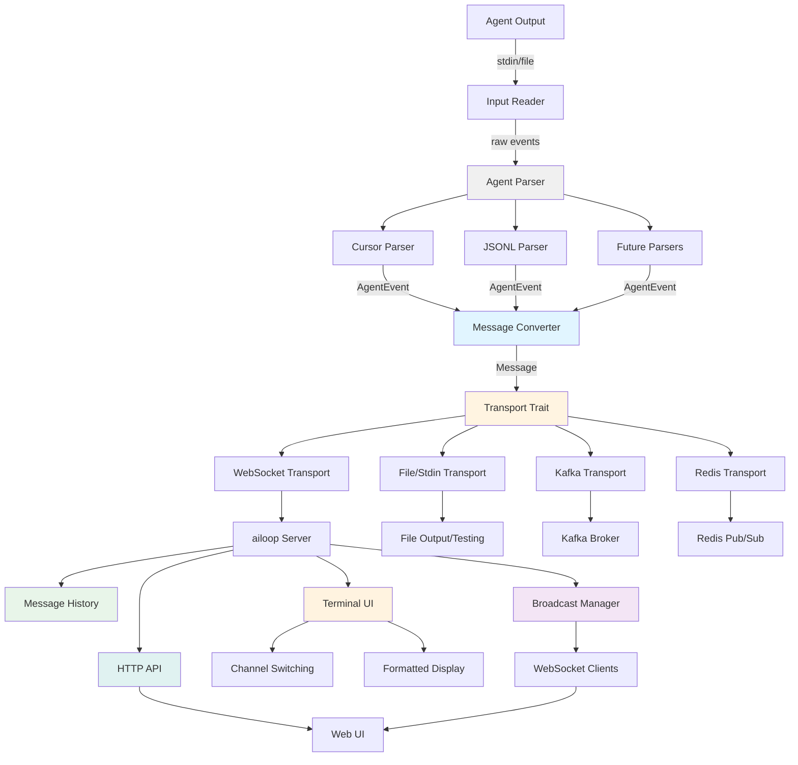

# ailoop Forward - Agent Message Streaming and Channeling

**Feature**: Stream agent output (Cursor CLI and other agents) to ailoop server with decoupled transport architecture, enabling centralized monitoring and web UI access.

**Created**: 2025-01-27
**Status**: Planning

## Architecture Overview

The system uses a decoupled architecture where the message converter is completely independent of transport mechanisms. This enables multiple transports (WebSocket, file/stdin, Kafka, Redis) and allows importing historical data for testing.



## Core Components

### 1. Transport Trait (`src/transport/mod.rs`)

Abstract transport interface that all transports implement:

```rust
#[async_trait]
pub trait Transport: Send + Sync {
    /// Send a message through the transport
    async fn send(&mut self, message: Message) -> Result<()>;
    
    /// Flush any buffered messages
    async fn flush(&mut self) -> Result<()>;
    
    /// Close the transport connection
    async fn close(&mut self) -> Result<()>;
    
    /// Get transport name for logging
    fn name(&self) -> &str;
}
```

This trait allows the converter to work with any transport without knowing implementation details.

### 2. Agent Event Parser System (`src/parser/mod.rs`)

Extensible parser system supporting multiple agent types - **transport-agnostic**:

**Parser Trait:**
```rust
#[async_trait]
pub trait AgentParser: Send + Sync {
    /// Parse a single line/event from agent output
    async fn parse_line(&mut self, line: &str) -> Result<Option<AgentEvent>>;
    
    /// Get agent type identifier
    fn agent_type(&self) -> &str;
    
    /// Get supported input formats
    fn supported_formats(&self) -> Vec<InputFormat>;
}
```

**Agent Event (unified across all agents):**
```rust
pub struct AgentEvent {
    pub agent_type: String,        // "cursor", "claude", "gpt", etc.
    pub event_type: EventType,
    pub content: serde_json::Value, // Agent-specific event data
    pub metadata: HashMap<String, String>, // Tags, session_id, etc.
    pub timestamp: Option<DateTime<Utc>>,
}

pub enum EventType {
    System,
    User,
    Assistant,
    ToolCall,
    Result,
    Error,
    Custom(String),
}
```

**Parser Implementations:**

#### 2.1 Cursor Parser (`src/parser/cursor.rs`)
- Parses Cursor CLI output formats (stream-json, json, text)
- Detects Cursor-specific event structure
- Extracts session_id, request_id, tool_call metadata

#### 2.2 Generic JSONL Parser (`src/parser/jsonl.rs`)
- Parses any JSONL format with agent type tags
- Supports `agent_type` field in JSON to identify agent
- Flexible metadata extraction from JSON fields
- Example format:
  ```json
  {"agent_type": "cursor", "type": "assistant", "message": "...", "session_id": "..."}
  {"agent_type": "claude", "type": "tool_call", "tool": "...", "args": {...}}
  ```

**Parser Factory:**
```rust
pub fn create_parser(
    agent_type: Option<String>,  // Auto-detect if None
    format: InputFormat,
) -> Result<Box<dyn AgentParser>> {
    match agent_type.as_deref() {
        Some("cursor") => Ok(Box::new(CursorParser::new(format)?)),
        Some("jsonl") | None => Ok(Box::new(JsonlParser::new(format)?)),
        // Future: other agent parsers
        _ => Err(anyhow::anyhow!("Unknown agent type: {:?}", agent_type)),
    }
}
```

### 3. Message Converter (`src/cli/message_converter.rs`)

Transform agent events to ailoop messages - **completely transport-independent and agent-agnostic**:

```rust
pub struct MessageConverter {
    channel: String,
    client_id: Option<String>,
    agent_type: String,
    session_id: Option<String>,
}

impl MessageConverter {
    pub fn new(channel: String, client_id: Option<String>, agent_type: String) -> Self;
    
    pub fn convert(&mut self, event: AgentEvent) -> Vec<Message> {
        // Transform agent events to messages
        // Returns Vec to handle cases where one event = multiple messages
        // Preserves agent_type and metadata in message.metadata
    }
    
    pub fn set_session_id(&mut self, session_id: String);
    pub fn set_agent_type(&mut self, agent_type: String);
}
```

**Conversion rules (agent-agnostic):**
- **Assistant events** → `Notification` (priority: normal)
  - Format: "[{agent_type}] {message_text}"
  - Include agent_type in metadata
- **Tool call events** → `Notification` (priority: low) with tool details
  - Format: "[{agent_type}] Tool: {tool_name} - {status}"
  - Include tool args/result in metadata
- **Result events** → `Notification` (priority: high) with final result
  - Format: "[{agent_type}] Result: {result_text}"
  - Include duration in metadata
- **User events** → Optional `Notification` (priority: low, for context)
- **System events** → Update internal state (session_id), no message
- **Error events** → `Notification` (priority: urgent) with error details

### 4. Transport Implementations

#### 4.1 WebSocket Transport (`src/transport/websocket.rs`)

```rust
pub struct WebSocketTransport {
    url: String,
    channel: String,
    client_id: Option<String>,
    connection: Option<WebSocketStream>,
}

impl Transport for WebSocketTransport {
    async fn send(&mut self, message: Message) -> Result<()> {
        // Ensure connection is established
        if self.connection.is_none() {
            self.connect().await?;
        }
        
        // Serialize and send message
        let json = serde_json::to_string(&message)?;
        // Send via WebSocket...
    }
    
    async fn reconnect(&mut self) -> Result<()>;
}
```

#### 4.2 File/Stdin Transport (`src/transport/file.rs`)

Supports both stdin and file input for testing/history import:

```rust
pub struct FileTransport {
    output: Option<Box<dyn AsyncWrite + Send + Unpin>>,
    file_path: Option<PathBuf>,
}

impl Transport for FileTransport {
    async fn send(&mut self, message: Message) -> Result<()> {
        // Write message as JSONL (one message per line)
        let json = serde_json::to_string(&message)?;
        // Write to file or stdout...
    }
}

// Factory function for stdin
pub fn stdin_transport() -> FileTransport;

// Factory function for file output
pub fn file_transport(path: PathBuf) -> Result<FileTransport>;
```

**Usage for testing:**
```bash
# Import history from JSONL file
cat history.jsonl | ailoop forward --transport file --output processed.jsonl

# Pipe to file for testing
cursor agent "task" --output-format stream-json | \
  ailoop forward --transport file --output test-output.jsonl
```

#### 4.3 Future Transports

**Kafka Transport** (`src/transport/kafka.rs`):
- Publish messages to Kafka topic
- Support for partitioning by channel/client_id

**Redis Transport** (`src/transport/redis.rs`):
- Publish to Redis pub/sub channels
- Support for Redis Streams (XADD)

### 5. Forward Command (`src/cli/forward.rs`)

Main orchestrator that connects parser → converter → transport:

```rust
pub struct ForwardCommand {
    parser: Box<dyn AgentParser>,
    converter: MessageConverter,
    transport: Box<dyn Transport>,
    input_source: InputSource,
}

pub enum InputSource {
    Stdin,
    File(PathBuf),
}

impl ForwardCommand {
    pub async fn run(&mut self) -> Result<()> {
        // Read from input source
        let reader = self.get_reader().await?;
        
        // Parse events (agent-agnostic)
        let mut event_stream = self.parse_stream(reader).await;
        
        // Process events
        while let Some(event_result) = event_stream.next().await {
            let event = event_result?;
            
            // Update converter with agent type from event
            self.converter.set_agent_type(event.agent_type.clone());
            
            // Convert to messages
            let messages = self.converter.convert(event);
            
            // Send via transport
            for message in messages {
                self.transport.send(message).await?;
            }
        }
        
        // Flush and close
        self.transport.flush().await?;
        self.transport.close().await?;
        
        Ok(())
    }
}
```

### 6. Transport Factory (`src/transport/factory.rs`)

Create transport instances based on configuration:

```rust
pub enum TransportType {
    WebSocket { url: String },
    File { path: Option<PathBuf> },
    Kafka { brokers: Vec<String>, topic: String },
    Redis { url: String, channel: String },
}

pub fn create_transport(
    transport_type: TransportType,
    channel: String,
    client_id: Option<String>,
) -> Result<Box<dyn Transport>> {
    match transport_type {
        TransportType::WebSocket { url } => {
            Ok(Box::new(WebSocketTransport::new(url, channel, client_id)?))
        }
        TransportType::File { path } => {
            Ok(Box::new(FileTransport::new(path)?))
        }
        // Future: Kafka, Redis...
    }
}
```

## CLI Command Structure

```rust
Forward {
    /// Input source: stdin or file path
    #[arg(long)]
    input: Option<PathBuf>,
    
    /// Transport type
    #[arg(long, default_value = "websocket")]
    transport: String,
    
    /// Transport-specific options (JSON)
    #[arg(long)]
    transport_config: Option<String>,
    
    /// Channel name
    #[arg(short, long, default_value = "public")]
    channel: String,
    
    /// Client identifier
    #[arg(long)]
    client_id: Option<String>,
    
    /// Input format: auto, json, stream-json, text
    #[arg(long, default_value = "auto")]
    format: String,
    
    /// Agent type: auto-detect, cursor, jsonl, etc.
    #[arg(long)]
    agent_type: Option<String>,
    
    /// Output file (for file transport)
    #[arg(long)]
    output: Option<PathBuf>,
}
```

**Usage examples:**

```bash
# WebSocket transport (default)
cursor agent "task" --output-format stream-json | \
  ailoop forward --transport websocket --server http://localhost:8080 --channel agent-1

# File transport for testing
cursor agent "task" --output-format stream-json | \
  ailoop forward --transport file --output test.jsonl

# Import history file
ailoop forward --input history.jsonl --transport websocket --server http://localhost:8080

# Future: Kafka transport
cursor agent "task" --output-format stream-json | \
  ailoop forward --transport kafka --transport-config '{"brokers":["localhost:9092"],"topic":"agent-events"}'
```

## Server Components

### 7. Message History Storage (`src/server/history.rs`)

Store message history per channel for UI display:

```rust
pub struct MessageHistory {
    channels: HashMap<String, Vec<StoredMessage>>,
    max_messages_per_channel: usize,
}

pub struct StoredMessage {
    pub message: Message,
    pub received_at: DateTime<Utc>,
    pub formatted: String,  // Pre-formatted for display
}

impl MessageHistory {
    pub fn new(max_messages: usize) -> Self;
    pub fn add_message(&mut self, channel: &str, message: Message);
    pub fn get_channel_messages(&self, channel: &str) -> &[StoredMessage];
    pub fn get_channels(&self) -> Vec<String>;
    pub fn clear_channel(&mut self, channel: &str);
}
```

### 8. WebSocket Client Broadcasting (`src/server/broadcast.rs`)

Broadcast messages to all connected WebSocket clients for real-time updates:

```rust
pub struct ClientConnection {
    pub id: Uuid,
    pub sender: SplitSink<WebSocketStream<TcpStream>, WsMessage>,
    pub subscribed_channels: HashSet<String>, // Empty = all channels
    pub connection_type: ConnectionType,
}

pub enum ConnectionType {
    Agent,    // Sends messages to server
    Viewer,  // Receives messages from server
}

pub struct BroadcastManager {
    clients: Arc<Mutex<HashMap<Uuid, ClientConnection>>>,
}

impl BroadcastManager {
    pub fn new() -> Self;
    
    /// Add a new client connection
    pub async fn add_client(&self, connection: ClientConnection) -> Uuid;
    
    /// Remove a client connection
    pub async fn remove_client(&self, client_id: Uuid);
    
    /// Broadcast message to all subscribed clients
    pub async fn broadcast(&self, message: &Message) -> Result<()> {
        // Send to all viewers subscribed to the message's channel
        // or subscribed to all channels
    }
    
    /// Get list of active channels from all clients
    pub fn get_active_channels(&self) -> Vec<String>;
}
```

**WebSocket Protocol for Viewers:**

**Client → Server:**
```json
// Subscribe to specific channels
{"type": "subscribe", "channels": ["channel1", "channel2"]}

// Subscribe to all channels
{"type": "subscribe", "channels": []}

// Unsubscribe from channels
{"type": "unsubscribe", "channels": ["channel1"]}
```

**Server → Client:**
```json
// New message event
{"type": "message", "message": {...Message object...}}

// Channel list update
{"type": "channels", "channels": ["channel1", "channel2", ...]}

// Connection confirmation
{"type": "connected", "client_id": "uuid"}
```

### 9. HTTP API Endpoints (`src/server/api.rs`)

REST API for web clients to query channels and messages:

```rust
pub struct ApiServer {
    channel_manager: Arc<ChannelIsolation>,
    history: Arc<MessageHistory>,
    broadcast_manager: Arc<BroadcastManager>,
}

impl ApiServer {
    // GET /api/channels
    // Returns: {"channels": ["channel1", "channel2", ...]}
    pub async fn list_channels(&self) -> Result<Json<ChannelList>>;
    
    // GET /api/channels/{channel}/messages?limit=100
    // Returns: {"messages": [...], "total": 150}
    pub async fn get_channel_messages(
        &self, 
        channel: &str, 
        limit: Option<usize>
    ) -> Result<Json<MessageList>>;
    
    // GET /api/channels/{channel}/stats
    // Returns: {"message_count": 150, "active_connections": 3, ...}
    pub async fn get_channel_stats(&self, channel: &str) -> Result<Json<ChannelStats>>;
}
```

**API Endpoints:**
- `GET /api/channels` - List all active channels
- `GET /api/channels/{channel}/messages?limit=N` - Get messages for a channel
- `GET /api/channels/{channel}/stats` - Get channel statistics
- `WebSocket /ws` - Real-time event stream

### 10. Enhanced Terminal UI (`src/server/terminal.rs`)

Interactive UI with channel switching and formatted message display:

**UI Layout:**
```
┌─────────────────────────────────────────────────────────┐
│ ailoop Server - Channel: [agent-1 ▼]                    │
├─────────────────────────────────────────────────────────┤
│ Channels: [agent-1] [agent-2] [public]                 │
├─────────────────────────────────────────────────────────┤
│                                                          │
│ [cursor] [2024-01-15 10:23:45]                          │
│ Assistant: I'll analyze the code structure...          │
│                                                          │
│ [cursor] [2024-01-15 10:23:46]                          │
│ Tool: readFile - completed                             │
│   File: src/main.rs (1254 chars)                       │
│                                                          │
│ [cursor] [2024-01-15 10:23:50]                          │
│ Result: Analysis complete. Found 3 issues.             │
│                                                          │
├─────────────────────────────────────────────────────────┤
│ Status: Running | Queue: 2 | Connections: 3             │
│ [Tab] Switch channel | [q] Quit | [c] Clear            │
└─────────────────────────────────────────────────────────┘
```

**Features:**
- **Channel switching**: Tab key cycles through channels, arrow keys navigate
- **Formatted messages**: Each message type has custom formatting
  - Assistant: Full text with word wrap
  - Tool calls: Tool name, status, args summary
  - Results: Highlighted result text
  - Errors: Red-highlighted error messages
- **Message metadata**: Display agent_type, timestamp, client_id
- **Scrollable history**: Navigate through message history with arrow keys
- **Real-time updates**: New messages appear as they arrive

### 11. Sample Web UI (`examples/web-ui/index.html`)

Sample HTML/JavaScript webpage demonstrating WebSocket integration:

**Features:**
- Channel list sidebar (auto-updates)
- Message display panel (formatted messages)
- Real-time updates via WebSocket
- Channel filtering/selection
- Message search/filtering
- Responsive design

**Structure:**
```
examples/
└── web-ui/
    ├── index.html          # Main HTML page
    ├── app.js              # JavaScript application
    ├── styles.css          # Styling
    └── README.md           # Usage instructions
```

**Key JavaScript Components:**

```javascript
class AiloopClient {
    constructor(serverUrl) {
        this.serverUrl = serverUrl;
        this.ws = null;
        this.channels = [];
        this.messages = new Map(); // channel -> messages[]
    }
    
    async connect() {
        // Connect to WebSocket
        this.ws = new WebSocket(`ws://${this.serverUrl}/ws`);
        
        // Subscribe to all channels
        this.ws.onopen = () => {
            this.ws.send(JSON.stringify({
                type: 'subscribe',
                channels: []
            }));
        };
        
        // Handle incoming messages
        this.ws.onmessage = (event) => {
            const data = JSON.parse(event.data);
            this.handleMessage(data);
        };
    }
    
    async fetchChannels() {
        // Fetch channel list via HTTP API
        const response = await fetch(`http://${this.serverUrl}/api/channels`);
        this.channels = await response.json();
        this.updateChannelList();
    }
    
    async fetchChannelMessages(channel) {
        // Fetch message history via HTTP API
        const response = await fetch(
            `http://${this.serverUrl}/api/channels/${channel}/messages?limit=100`
        );
        const data = await response.json();
        this.messages.set(channel, data.messages);
        this.displayMessages(channel);
    }
    
    handleMessage(data) {
        switch(data.type) {
            case 'message':
                this.addMessage(data.message);
                break;
            case 'channels':
                this.channels = data.channels;
                this.updateChannelList();
                break;
        }
    }
}
```

**UI Layout:**
```html
<div class="container">
    <div class="sidebar">
        <h2>Channels</h2>
        <ul id="channel-list"></ul>
    </div>
    <div class="main">
        <div class="header">
            <h1 id="channel-name">Select a channel</h1>
            <span id="connection-status">Connecting...</span>
        </div>
        <div class="messages" id="messages-container"></div>
    </div>
</div>
```

## File Structure

```
src/
├── transport/
│   ├── mod.rs              # Transport trait and factory
│   ├── websocket.rs        # WebSocket transport implementation
│   ├── file.rs             # File/stdin transport implementation
│   └── kafka.rs            # FUTURE: Kafka transport
│   └── redis.rs            # FUTURE: Redis transport
├── parser/
│   ├── mod.rs             # Parser trait and factory
│   ├── cursor.rs           # Cursor-specific parser
│   └── jsonl.rs            # Generic JSONL parser
├── cli/
│   ├── message_converter.rs # Event to Message converter (transport-agnostic)
│   ├── forward.rs          # Forward command orchestrator
│   ├── handlers.rs         # MODIFY: Add handle_forward
│   └── commands.rs         # (no changes needed)
├── server/
│   ├── api.rs              # HTTP API endpoints (REST)
│   ├── broadcast.rs        # WebSocket client broadcasting
│   ├── history.rs          # Message history storage per channel
│   ├── server.rs           # MODIFY: Client tracking, metadata, history, broadcasting
│   └── terminal.rs         # MODIFY: Channel switching, formatted message display
└── models/
    └── message.rs          # MODIFY: Add metadata field
examples/
└── web-ui/
    ├── index.html      # Sample web UI
    ├── app.js          # JavaScript client
    ├── styles.css      # Styling
    └── README.md       # Usage instructions
```

## Implementation Steps

1. **Create transport trait and factory** (`src/transport/mod.rs`, `src/transport/factory.rs`)
2. **Create parser trait and factory** (`src/parser/mod.rs`) - extensible for multiple agents
3. **Implement Cursor parser** (`src/parser/cursor.rs`) - Cursor-specific parsing
4. **Implement generic JSONL parser** (`src/parser/jsonl.rs`) - supports any agent with tags
5. **Create message converter** (`src/cli/message_converter.rs`) - agent-agnostic conversion
6. **Implement WebSocket transport** (`src/transport/websocket.rs`)
7. **Implement File transport** (`src/transport/file.rs`) - supports stdin and file I/O
8. **Create forward command** (`src/cli/forward.rs`) - orchestrates parser → converter → transport
9. **Add Forward command to CLI** (`src/main.rs`, `src/cli/handlers.rs`)
10. **Extend Message model** (`src/models/message.rs`) - add metadata field
11. **Create message history storage** (`src/server/history.rs`) - per-channel message storage
12. **Create broadcast manager** (`src/server/broadcast.rs`) - WebSocket client broadcasting
13. **Enhance server** (`src/server/server.rs`) - integrate history, client tracking, broadcasting
14. **Add HTTP API** (`src/server/api.rs`) - REST endpoints for channels and messages
15. **Enhance terminal UI** (`src/server/terminal.rs`) - channel switching, formatted display
16. **Create sample web UI** (`examples/web-ui/`) - HTML/JS webpage with WebSocket integration

## Multi-Agent Support

The system is designed to support multiple agent types through the extensible parser system:

**Current agents:**
- **Cursor**: Cursor CLI output (stream-json, json, text formats)
- **Generic JSONL**: Any agent outputting JSONL with `agent_type` field

**Adding new agents:**
1. Implement `AgentParser` trait for the new agent
2. Register parser in factory (or use generic JSONL parser)
3. Agent-specific metadata is preserved in `Message.metadata`
4. UI automatically displays agent type in formatted messages

**Example JSONL format for any agent:**
```json
{"agent_type": "my-agent", "type": "assistant", "message": "Hello", "session_id": "123"}
{"agent_type": "my-agent", "type": "tool_call", "tool": "search", "args": {...}}
```

## WebSocket Client Integration

### Connection Types

The server supports two types of WebSocket connections:

1. **Agent Connections** (existing):
   - Send messages TO the server
   - Used by `ailoop forward` command
   - One-way: Agent → Server

2. **Viewer Connections** (new):
   - Receive messages FROM the server
   - Used by web UI and monitoring clients
   - One-way: Server → Viewer
   - Supports channel subscription/filtering

### WebSocket Protocol

**Connection URL:** `ws://host:port/ws`

**Client Handshake:**
```json
// Optional: Specify connection type and subscribe to channels
{"type": "subscribe", "channels": ["channel1", "channel2"]}
// Empty channels array = subscribe to all channels
```

**Server Events:**
```json
// New message
{"type": "message", "message": {
    "id": "uuid",
    "channel": "channel1",
    "sender_type": "AGENT",
    "content": {...},
    "timestamp": "2024-01-15T10:23:45Z",
    "metadata": {"agent_type": "cursor", "client_id": "client-1"}
}}

// Channel list update
{"type": "channels", "channels": ["channel1", "channel2", "channel3"]}

// Connection confirmation
{"type": "connected", "client_id": "uuid"}
```

### Sample Web UI Usage

1. Start ailoop server:
   ```bash
   ailoop serve --host 0.0.0.0 --port 8080
   ```

2. Open `examples/web-ui/index.html` in a browser
   - Or serve via HTTP server: `cd examples/web-ui && python -m http.server 3000`
   - Configure server URL in `app.js` (default: `localhost:8080`)

3. The web UI will:
   - Connect to WebSocket server
   - Fetch and display channel list
   - Show real-time messages as they arrive
   - Allow switching between channels
   - Display formatted messages with metadata

## Testing Strategy

### Unit Tests
- Parser tests: All three input formats
- Converter tests: Event → Message transformation
- Transport tests: Each transport implementation

### Integration Tests
- End-to-end: stdin → parser → converter → transport
- File import: JSONL file → parser → converter → transport
- Transport switching: Same input, different transports

### Test Utilities
- Mock transport for testing converter in isolation
- Sample Cursor CLI output files for parser testing
- JSONL file generator for history import testing

## Benefits of Decoupled Architecture

1. **Testability**: Converter can be tested independently with mock transports
2. **Flexibility**: Easy to add new transports without changing converter
3. **History Import**: File transport enables importing past sessions
4. **Scalability**: Future transports (Kafka, Redis) for distributed systems
5. **Separation of Concerns**: Parser, converter, and transport are independent

## Future Transport Implementations

### Kafka Transport
- Publish to Kafka topics
- Partition by channel or client_id
- Support for Kafka headers (metadata)

### Redis Transport
- Redis Pub/Sub for real-time distribution
- Redis Streams (XADD) for message persistence
- Support for multiple subscribers

### HTTP Transport
- POST messages to HTTP endpoint
- Batch sending for efficiency
- Retry logic with exponential backoff

## Error Handling

- **Parser errors**: Log and skip malformed lines, continue processing
- **Converter errors**: Log and skip invalid events, continue processing
- **Transport errors**: 
  - WebSocket: Attempt reconnection with exponential backoff
  - File: Log and continue (don't fail on write errors)
  - Future transports: Transport-specific error handling

## Dependencies

**New dependencies needed:**
- `async-trait = "0.1"` - For Transport and AgentParser traits

**Existing dependencies (already in Cargo.toml):**
- `tokio-tungstenite` - WebSocket support
- `serde_json` - JSON serialization
- `tokio` - Async runtime
- `futures-util` - Stream utilities
- `warp` - HTTP server (for REST API)
- `uuid` - Message IDs
- `chrono` - Timestamps

**Future dependencies (only when implementing):**
- `rdkafka` - For Kafka transport
- `redis` - For Redis transport
